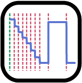

# the _labscript suite_

<!--  -->

<a href="https://github.com/labscript-suite/labscript"></a> <a href="https://github.com/labscript-suite/runmanager"></a> <a href="https://github.com/labscript-suite/blacs"></a> <a href="https://github.com/labscript-suite/lyse"></a> <a href="https://github.com/labscript-suite/runviewer"></a>

### Experiment control and automation system

___

The _labscript suite_ is a powerful and extensible framework for experiment [composition](https://github.com/labscript-suite/labscript), [control](https://github.com/labscript-suite/runmanager), [execution](https://github.com/labscript-suite/blacs), and [analysis](https://github.com/labscript-suite/labscript). Developed for quantum science and quantum engineering, from laboratory to in-field devices. Applicable to optics, microscopy, materials engineering, biophysics, and any application predicated on the repetition of parameterised, hardware-timed experiments.

This is a metapackage for the _labscript suite_. Formerly the _labscript suite_ installer repository, prior to the packages being installable via [PyPI](https://pypi.org/user/labscript-suite) and [Anaconda Cloud](https://anaconda.org/labscript-suite).


#### Features:
- Flexible and automated oversight of heterogeneous hardware.
- The most mature and widely used open-source control system in quantum science.
- Multiple analysis-based feedback modes.
- Extensible plugin architecture (e.g. machine learning online optimisation).
- Readily integrates with other software, including image acquisition, analysis, and even other control systems.
- Compose experiments as human-readable Python code, leveraging modularity, revision control and re-use.
- Dynamic visualisation of experiment composition and results.
- Remote operation: different modules can run on physically separate hosts / single modules can be run on multiple hosts (including hardware supervisor, [blacs](https://github.com/labscript-suite/blacs)).
- Auto-generating user-interfaces.
- High-level scripting: all user-interface interaction can be programatically synthesised.

## Table of contents

- [Installing the _labscript suite_](#installing-the-labscript-suite)
  - [Virtual environments](#virtual-environments)
  - [Regular installation](#regular-installation-from-the-python-package-index)
  - [Developer installation](#developer-installation-for-those-who-want-to-customize-the-labscript-suite)
  - [Updating a regular installation](#updating-a-regular-installation)
  - [Updating a developer installation](#updating-a-developer-installation)
- [Recent changes to the _labscript suite_](#recent-changes-to-the-labscript-suite)
  - [Profile directories](#changes-to-profile-directories)
  - [Application shortcuts](#changes-to-application-shortcuts)
  - [Source code structure](#changes-to-source-code-structure)
  - [Versioning](#changes-to-versioning)
- [BitBucket archive](#bitbucket-archive)
  - [What to do if you had custom code in a fork on BitBucket](#what-to-do-if-you-had-custom-code-in-a-fork-on-bitbucket)
  - [Migrating other repositories to GitHub](#migrating-other-repositories-to-github)
- [Contributing to the _labscript suite_](#contributing-to-the-labscript-suite)
  - [Issue tracking](#issue-tracking)
  - [Request for developers](#request-for-developers)
  - [Pull requests](#pull-requests)
  - [Branching model/strategy](#branching-modelstrategy)
  - [Learning Git](#learning-git)
- [Citing the _labscript suite_](#citing-the-labscript-suite)

## Installing the _labscript suite_

We're excited to announce that accompanying the recent migration to GitHub, _labscript suite_ components are now distributed as Python packages on [PyPI](https://pypi.org/user/labscript-suite) and [Anaconda Cloud](https://anaconda.org/anaconda/conda).

This makes it far easier to get started using the _labscript suite_, as you no longer require a Mercurial or Git installation (or any knowledge of version control software); components can be installed and upgraded using:

* [`pip`](https://packaging.python.org/tutorials/installing-packages): the standard package manager common to all Python distributions; or 
* [`conda`](https://anaconda.org/anaconda/conda): a binary package and environment manager, part of the [Anaconda Python](https://www.anaconda.com) distribution.


### Virtual environments

We recommend installing labscript (regular or developer mode) in a [virtual environment](https://packaging.python.org/tutorials/installing-packages/#creating-virtual-environments). This helps sandbox the codebase without interfering with (or being interfered with) your system Python installation, or Python environments used for other purposes. There are a number of ways to configure a virtual environment. If you are unfamiliar with doing so, we recommend using the [venv module](https://docs.python.org/3/library/venv.html), part of the Python Standard Library. Here’s an example (on Windows):


#### Quick start

```
C:\> mkdir labscript-suite
C:\> cd labscript-suite
C:\labscript-suite> python -m venv .venv
C:\labscript-suite> .venv\Scripts\activate
(.venv) C:\labscript-suite> python -m pip install --upgrade pip setuptools wheel
```
Once activated, the name of the virtual environment (in this case, `.venv`) will prefix the command line.


#### Detailed instructions

1. From a new terminal, create the installation directory and enter it. Here we use `C:\labscript-suite` but this can be whatever you like:

    ```
    C:\> mkdir labscript-suite
    C:\> cd labscript-suite
    ```

2. Create a virtual environment. Here we name it `.venv`, located inside the installation directory (name and location are also variable but these are conventional choices).

    ```
    C:\labscript-suite> python -m venv .venv
    ```

3. Activate the virtual environment:

    ```
    C:\labscript-suite> .venv\Scripts\activate
    ```

    _Note:_ This step is OS specific, e.g. on Linux it’s `source .venv/bin/activate`.

4. Update the Python package installer and other installation packages of your virtual environment.

    ```
    (.venv) C:\labscript-suite> python -m pip install --upgrade pip setuptools wheel
    ```


### Regular installation from the Python Package Index

If you are using a virtual environment ([above](#virtual-environments)), activate it before executing the following commands. In this example, we will use the installation directory `C:\labscript-suite` with an existing virtual environment, not yet activated (skip the first two lines/steps if continuing on from above).


#### Quick start

```
C:\labscript-suite> .venv\Scripts\activate
(.venv) C:\labscript-suite> python -m pip install --upgrade pip setuptools wheel
(.venv) C:\labscript-suite> pip install labscript-suite
(.venv) C:\labscript-suite> pip install PyQt5
(.venv) C:\labscript-suite> labscript-profile-create
(.venv) C:\labscript-suite> desktop-app install blacs lyse runmanager runviewer
```


#### Detailed instructions

1. Activate the virtual environment (this step is OS specific, e.g. on Linux it’s `source .venv/bin/activate`).

    ```
    C:\labscript-suite> .venv\Scripts\activate
    ```

2. Update the Python package installer and other installation packages of your virtual environment.

    ```
    (.venv) C:\labscript-suite> python -m pip install --upgrade pip setuptools wheel
    ```

3. Install the meta-package from PyPI. This will install blacs, labscript, labscript-devices, labscript-utils, lyse, runmanager, runviewer, and all dependencies (except the bindings to the GUI toolkit and device-driver specific packages):

    ```
    (.venv) C:\labscript-suite> pip install labscript-suite
    ```

4. Install PyQt5, the bindings to the GUI toolkit (not installed above for licensing reasons):

    ```
    (.venv) C:\labscript-suite> pip install PyQt5
    ```

5. Create a profile directory in your home directory (the new location of user data; more [below](#changes-to-profile-directories)):

    ```
    (.venv) C:\labscript-suite> labscript-profile-create
    ```

6. (Optional) Create shortcuts for the GUI applications (blacs, lyse, runmanager, and runviewer) and place them in the start-menu (or non-Windows OS equivalent).

    ```
    (.venv) C:\labscript-suite> desktop-app install blacs lyse runmanager runviewer
    ```

    These will be named, e.g. ‘runmanager – the labcript suite’ which when clicked on will:

   * Launch the application without a terminal window, using the virtual environment the above command was called in.
   * Display the application with an application-specific shortcut in the taskbar (which can be pinned, like any other desktop application).

    Virtual environments named anything other than `.venv` will be included in the name of the shortcut, e.g. ‘runmanager – the labscript suite (py38)’ for a virtual environment named `py38`.

Alternatively, you can launch the applications from a terminal, e.g. 

```
(.venv) C:\> runmanager
```

This will print debugging information to the console.

To launch the applications detached from the console, suffix the application name with `-gui`, e.g.

```
(.venv) C:\> runmanager-gui
```

_Note:_ You must have activated the virtual environment in which the _labscript suite_ was installed to use these commands.


### Developer installation (for those who want to customize the _labscript suite_)

_Note:_ You do not necessarily need not fork, clone, and install editable versions of all _labscript suite _repositories to customise your installation and/or contribute these changes back to the base repositories. For example, if you only want to develop custom labscript device drivers, you might only fork and clone the labscript-devices repository. Moreover, there is now an option to write and use custom labscript device drivers outside of the labscript-devices installation directory.


#### Quick start

_Coming soon!_


#### Detailed instructions

1. Fork the labscript-suite repositories you want to develop using the [GitHub online](https://help.github.com/en/github/getting-started-with-github/fork-a-repo). Below we will include all repositories (except the labscript-suite metapackage).

2. Use `pip` to both clone these forks locally and install them into your environment. In this example (on Linux), the forks are owned by the (non-existent) GitHub user wkheisenberg.

    ```
    $ pip install \
    --src . -e git+https://github.com/wkheisenberg/blacs#egg=blacs \
    --src . -e git+https://github.com/wkheisenberg/labscript#egg=labscript \
    --src . -e git+https://github.com/wkheisenberg/labscript-devices#egg=labscript-devices \
    --src . -e git+https://github.com/wkheisenberg/labscript-utils#egg=labscript-utils \
    --src . -e git+https://github.com/wkheisenberg/runmanager#egg=runmanager \
    --src . -e git+https://github.com/wkheisenberg/runviewer#egg=runviewer \
    --src . -e git+https://github.com/wkheisenberg/lyse#egg=lyse
    ```

    _Notes:_

    *   This will set your forked repository(ies) to be the ‘origin’ remote.
    *   On Windows the line continuation character is `^` rather than `\`.

    Alternatively, manually clone the repositories using <code>[git clone](https://help.github.com/en/github/creating-cloning-and-archiving-repositories/cloning-a-repository)</code> and then install them using `pip` by running the following from the common parent directory:

    ```
    $ pip install -e blacs -e labscript -e labscript-devices -e labscript-utils \
        -e lyse -e runmanager -e runviewer
    ```

    For a single package, this would look like:

    ```
    $ git clone https://github.com/wkheisenberg/runmanager.git
    $ pip install -e runmanager
    ```

3. For each repository, set the upstream remote to the base labscript-suite repository:


    ```
    $ cd blacs
    $ git remote add upstream https://github.com/labscript-suite/blacs.git
    $ cd ..
    ```

    Repeat for the other repositories.

4. Continue from step 4 (install PyQt5) in the [regular installation instructions](#regular-installation-from-the-python-package-index).


### Updating a regular installation

Individual components of the labscript suite can be updated using the `--upgrade` (`-U`) flag of `pip`. For example:

```
(.venv) C:\labscript-suite> pip install -U runmanager
```

To upgrade to a pre-release version, you can use the `--pre` (pre-relase) flag:

```
(.venv) C:\labscript-suite> pip install -U --pre runmanager
```

If updating multiple components, use a single pip install command for this to ensure dependency resolution is best dealt with:

```
(.venv) C:\labscript-suite> pip install -U labscript lyse runmanager
```

You can also update (or downgrade) to a specific version:

```
(.venv) C:\labscript-suite> pip install runmanager==2.5.0
```

Development versions will be suffixed with `devN`, i.e.

```
(.venv) C:\labscript-suite> pip install runmanager==2.6.0dev3
```


### Updating a developer installation

This assumes you have already completed the developer installation above and have:

*   Forked a _labscript suite_ repository on GitHub;
*   Cloned the repository;
*   Set your fork to be the ‘origin’ remote; and
*   Set the labscript-suite base repository to be the ‘upstream’ remote.

1. Use one of the following to keep your repository (and feature branches) up-to-date:

    [Fetch changes, and merge](https://help.github.com/en/github/using-git/getting-changes-from-a-remote-repository#fetching-changes-from-a-remote-repository) with your local master branch.

    ```
    $ git checkout master
    $ git fetch upstream master --tags
    $ git merge upstream/master
    ```

    Or using [Git Pull](https://help.github.com/en/github/using-git/getting-changes-from-a-remote-repository#pulling-changes-from-a-remote-repository):

    ```
    $ git checkout master
    $ git pull upstream master --tags
    ```

    Or using [hub sync](https://hub.github.com/) command-line extension (does not require current local working branch to be master):

    ```
    $ hub sync
    ```

2. Update your feature branches by merging them with master or rebasing them to master:

    ```
    $ git checkout your-feature-name
    $ git merge master <OR> git rebase master --autostash
    ```

3. Update your fork by [pushing](https://help.github.com/en/github/using-git/pushing-commits-to-a-remote-repository) any changes resulting from steps 1–2 and/or subsequent local development:

    ```
    $ git checkout master
    $ git push origin master --tags
    $ git checkout your-feature-name
    $ git push origin your-feature-name master
    ```

    _Note:_ If the feature branch has not yet been created on your fork, you need to include `-u` above, i.e.

    ```
    $ git push -u origin your-feature-name
    ```

4. Checkout the commit you want to install. This might be a specific release version (which can be specified by tag):

    ```
    $ git checkout v0.3.2
    ```

    ... or using the commit SHA:

    ```
    $ git checkout 59651b5
    ```

5. (Optional) Update the package using (from within the root of a repository):

    ```
    $ pip install -e .
    ```

    As the installations are in editable mode and the version is being introspected at runtime, this step is not always necessary, but is required for any change requiring setup.py to be run to take effect, e.g. dependency changes, console entry points, etc.


## Recent changes to the _labscript suite_

Upon migrating the code base to GitHub and publishing distributions on PyPI in April–May 2020, the following changes have been undertaken.

### Changes to profile directories

The _labscript suite_ profile directory, containing application configurations, logs, and user-side code, is now located by default in the current user’s home directory, e.g.

* `C:\Users\wkheisenberg\labscript-suite` on Windows.
* `~/labscript-suite` or `/home/wkheisenberg/labscript-suite` on Linux and Mac OS X.

A typical structure is:

```
    ~/labscript-suite/
    ├── app_saved_configs/
    │   ├── default_experiment/
    ├── labconfig/
    ├── logs/
    └── userlib/
        ├── analysislib/
        ├── labscriptlib/
        ├── pythonlib/
        └── user_devices/
```

This structure is created by calling the command `labscript-profile-create`.

in a terminal after installing `labscript-utils` (per the [installation instructions](#regular-installation-from-the-python-package-index)).

_Note:_ As of [labscript-suite/labscript-utils#37](https://github.com/labscript-suite/labscript-utils/issues/37) this can be the same directory as an editable installation.


### Changes to application shortcuts

Operating-system menu shortcuts, correct taskbar behaviour, and environment activation for the Python GUI applications (blacs, lyse, runmanager, and runviewer) is now handled by a standalone Python package [desktop-app](https://github.com/chrisjbillington/desktop-app) (per installation instructions above). This currently supports Windows and Linux (Mac OS X support is forthcoming).


### Changes to source code structure

Existing users who move to a developer (editable) installation, please note the following structural changes to the _labscript suite_ source code:

* Each package has a top-level folder containing setup.py and setup.cfg used to build a distribution from source. The functional code base now resides in a subfolder corresponding to the name of the Python module, e.g. an editable installation might contain folders:

    ```
    <path-to-your-labscript-installation>/
    ├── blacs/
    │   └── blacs/
    ├── labscript/
    │   └── labscript/
    ├── labscript-devices/
    │   └── labscript_devices/
    ├── labscript-utils/
    │   └── labscript_utils/
    ├── lyse/
    │   ├── lyse/
    ├── runmanager/
    │   └── runmanager/
    └── runviewer/
        └── runviewer/
    ```


* Package names (shared by repositories and top-level folders) are now hyphenated, e.g. labscript-devices and labscript-utils.
* Module names remain underscored, i.e. labscript_devices and labscript_utils.
* The mixing of hyphen and underscores is inelegant but conventional.
* All references to blacs are now lowercase.
* As installation no longer requires a separate package, the repository formerly named ‘installer’ has been renamed to ‘[labscript-suite](https://github.com/labscript-suite/labscript-suite/issues)’, and will be used as a metapackage for the labscript suite.


### Changes to versioning

Aside from the maintenance branches described [below](#branching-modelstrategy), versions of the labscript suite packages are introspected at run-time using either the [importlib.metadata](importlib.metadata) library (regular installations) or [setuptools_scm](https://github.com/pypa/setuptools_scm) (developer installations). Thus any changes to an editable install will be traceable by local version numbers, e.g. editing the released version of a package with version  2.4.0 will result in 2.4.0dev1+gc28fe94, for example. This will help us diagnose issues users have with their editable installations.


## BitBucket archive

Some repository metadata (such as pull request discussions) could not be migrated directly from BitBucket to GitHub. As such, we have created an archived copy of everything that was on BitBucket. This includes:

* Issues (as they appear on BitBucket);
* Pull requests discussions;
* Commit comments for every labscript suite repository; and
* Every public fork (as of 1st February, 2020).

This archive can be found at [bitbucket-archive.labscriptsuite.org](https://bitbucket-archive.labscriptsuite.org/) (this page can take some time to load for the first time). Copies of every public fork of our repositories are at [github.com/labscript-suite-bitbucket-archive](https://github.com/labscript-suite-bitbucket-archive). As this is an archive, we will not be transferring ownership of these repositories back to their original owners. However, should you wish to continue development on one of those repositories you can fork it into your own account through the GitHub web interface. Should you have uncommitted changes (or changes made after 1st February, 2020) that you wish to have archived, please contact us to discuss the best approach to including these. Please note that we are not recommending continuing development in such forks long term, due to the changes in package structure outlined above.


### What to do if you had custom code in a fork on BitBucket

_Coming soon!_

### Migrating other repositories to GitHub

Should you have other repositories on BitBucket such as labscriptlib, analysislib, userlib, or labconfig (or any project unrelated to the _labscript suite_) we strongly suggest using the tools we developed to migrate the _labscript suite_. These are [philipstarkey/bitbucket-hg-exporter](https://github.com/philipstarkey/bitbucket-hg-exporter) and [chrisjbillington/hg-export-tool](https://github.com/chrisjbillington/hg-export-tool) which can be used together. See the documentation of those projects for further details.

## Contributing to the _labscript suite_

We are very grateful for all the contributions users have made in the past decade to make the _labscript suite_ the most widely used open-source experiment control and automation system in quantum science. These include development, suggestions, and feedback, and we look forward to this continuing on GitHub.


### Issue tracking

The issue tracking on GitHub is very similar to BitBucket, with the added advantage that you can add inter-repository issue references, e.g. referring to [labscript-suite/runmanager#68](https://github.com/labscript-suite/runmanager/issues/68) in any issue or pull request will link to the corresponding issue. We have imported all issues from the BitBucket repositories into the GitHub repositories. This import is not perfect (as each comment is now posted by Phil Starkey) but the comments have been modified to contain the original author attribution. We have also updated all links to files, pull requests, issues, and commits so that they point to the equivalent GitHub location and/or the archived copy of the data (as discussed above).

Please use the GitHub issue tracker (rather than the mailing list) for:

* Reporting **bugs** (when something doesn’t work or works ina way you didn’t expect);
* Suggesting **enhancements**: new features or requests;
* Issues relating to **installation**, **performance**, or **documentation**.

However, advice for how to do something with the existing functionality of the _labscript suite_ is better suited to the mailing list.


### Request for developers

We would like to reaffirm our invitation for users to directly contribute toward developing the _labscript suite_. We have established a separate discussion forum on Zulip for discussing development direction and design. If you are interested in being a part of these discussions, and/or testing and merging pull requests, please [reach out to us](mailto:labscriptsuite@gmail.com).


### Pull requests

We will continue the same feature-branch workflow as before:

1. [Fork](https://guides.github.com/activities/forking/) one or more of the labscript suite repositories;
2. Create a branch on your fork for a new feature; 
3. Make and commit changes to this branch; and 
4. Make a pull request back to our repository. 

These steps are broadly covered in the GitHub [Hello World](https://guides.github.com/activities/hello-world/) guide, and in detail on the [NumPy development workflow](https://numpy.org/doc/stable/dev/development_workflow.html).


### Branching model/strategy

The move to GitHub for source control and PyPI for distribution is accompanied by a slight change in the branching strategy, to improve deployment and stability of the _labscript suite_. Whereas before all versions corresponded to single commits on the master branch; dedicated branches will be used to release and service minor versions. For example, releasing v0.1.0 would see the creation of a branch named maintenance/0.1.x, used to service all 0.1 versions. As we adhere to [semantic versioning](https://semver.org/), bug-fixes would be applied in this branch, bumping the minor (final) version number each time, e.g. 0.1.1, 0.1.2, etc. No development will occur in these branches; new features are merged into master, and bug-fixes are cherry-picked from master.

You can learn more about this branching model at:

* [releaseflow.org](http://releaseflow.org/)
* [NumPy development workflow](https://numpy.org/doc/stable/dev/development_workflow.html)
* [Release Flow – Azure DevOps](https://docs.microsoft.com/en-us/azure/devops/learn/devops-at-microsoft/release-flow)


### Learning Git

As our former development, installation, and upgrading practices involved Mercurial revision-control, some of you may not be familiar with Git. While you no longer need to use _any_ revision control system to use the _labscript suite_, those of you wanting to contribute to development who aren’t acquainted with Git may benefit from these resources:

* NumPy: [Getting started with Git development](https://numpy.org/doc/stable/dev/gitwash/development_setup.html)
* [GitHub Guides](https://guides.github.com/): Very cogent information for beginners. We recommend starting with:
    * [Hello World](https://guides.github.com/activities/hello-world/) (covers the basic process 
    * [Git Handbook](https://guides.github.com/introduction/git-handbook/)
    	_Note:_ You may notice references to ‘GitHub Flow’ in these guides (and ‘Git Flow’ elsewhere). These share some aspects of the Release Flow branching-workflow we use, but are distinct.
* [Atliassian Git Tutorials](https://www.atlassian.com/git/tutorials): Despite the many references to BitBucket (ignore these); there is a wealth of excellent beginner information for using Git at the command line here; and finally
* [Oh Shit, Git!?!](https://ohshitgit.com/) Mistakes happen. This is a good place to start fixing them. ([Censored version](https://dangitgit.com/).)


## Citing the _labscript suite_

If you use the _labscript suite_ to control your experiment or perform analysis, please cite one or more of the following publications:

<!-- 1. _A scripted control system for autonomous hardware-timed experiments,_ [Review of Scientific Instruments **84**, 085111 (2013)](https://doi.org/10.1063/1.4817213). arXiv: [1303.0080](http://arxiv.org/abs/1303.0080). -->

<details>
  <summary>P. T. Starkey, <em><a href="https://doi.org/10.26180/5d1db8ffe29ef">A software framework for control and automation of precisely timed experiments</a>.</em>  PhD thesis, Monash University (2019).</summary>

  ```bibtex
    @phdthesis{starkey_phd_2019, 
      title = {State-dependent forces in cold quantum gases}, 
      author = {Starkey, P. T.},
      year = {2019},
      url = {https://doi.org/10.26180/5d1db8ffe29ef}, 
      doi = {10.26180/5d1db8ffe29ef},
      school = {Monash University},
    }
  ```
</details>

<details>
  <summary>C. J. Billington, <em><a href="https://doi.org/10.26180/5bd68acaf0696">State-dependent forces in cold quantum gases</a>.</em>  PhD thesis, Monash University (2018).</summary>

  ```bibtex
    @phdthesis{billington_phd_2018, 
      title = {State-dependent forces in cold quantum gases}, 
      author = {Billington, C. J.},
      year = {2018},
      url = {https://doi.org/10.26180/5bd68acaf0696}, 
      doi = {10.26180/5bd68acaf0696},
      school = {Monash University},
    }
  ```
</details>

<details>
  <summary><em><a href="https://doi.org/10.1063/1.4817213">A scripted control system for autonomous hardware-timed experiments</a>,</em> Review of Scientific Instruments <b>84</b>, 085111 (2013). arXiv:<a href="http://arxiv.org/abs/1303.0080">1303.0080</a>.</summary>

  ```bibtex
    @article{labscript_2013,
      author = {Starkey, P. T. and Billington, C. J. and Johnstone, S. P. and
                Jasperse, M. and Helmerson, K. and Turner, L. D. and Anderson, R. P.},
      title = {A scripted control system for autonomous hardware-timed experiments},
      journal = {Review of Scientific Instruments},
      volume = {84},
      number = {8},
      pages = {085111},
      year = {2013},
      doi = {10.1063/1.4817213},
      url = {https://doi.org/10.1063/1.4817213},
      eprint = {https://doi.org/10.1063/1.4817213}
    }
  ```
</details>
